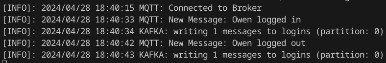

# Pachamama MQTT Broker to Kafka Producer

This microservice acts as a bridge between our BlueIris CCTV system and our event-driven architecture at Pachamama Group. It converts incoming MQTT messages from an MQTT broker subscription into Kafka topic events.


## Functionality

1. **MQTT Topic Subscription**: Microservice connects to an MQTT broker and subscribes to a topic.
2. **MQTT Incoming Message Handling**: Processes incoming messages to a queue and signals a notification over a channel.
3. **MQTT Message Reading**: Reads message from queue and stores into a buffer.
4. **Kafka Write Message**: Writes buffered messaged to the Kafka topic.



## Usage

### Build from source
1. Clone repository
2. Export environment variables, they can be found in Dockerfile.
3. Create executable in /cmd/main.go

### Dockerfile
1. Fill the environment variables in Dockerfile.

    ```
    RUN go build -o ./cmd/main ./cmd/main.go
    
    ENV MQTT-BROKER=...
    ENV MQTT-PORT=...
    ENV MQTT-TOPIC=...
    ...
    ```
2. Create Docker image.
    ```
    docker build -t "mqtt-kafka-producer-img"
    ```
3. Create Docker container
    ```
    docker run -d --name "mqtt-kafka-producer" "mqtt-kafka-producer-img"

## Dependencies

- https://github.com/eclipse/paho.mqtt.golang
- https://github.com/segmentio/kafka-go